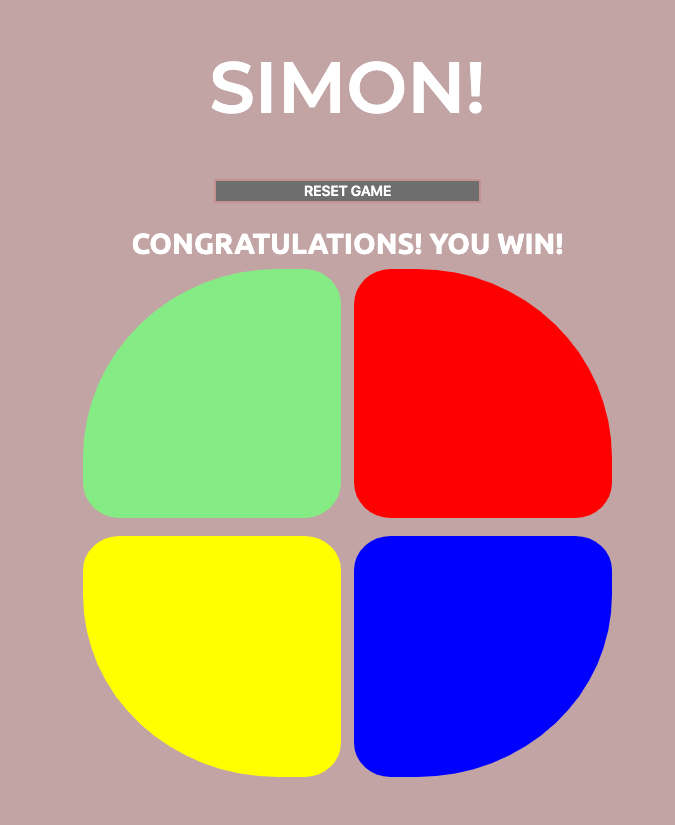
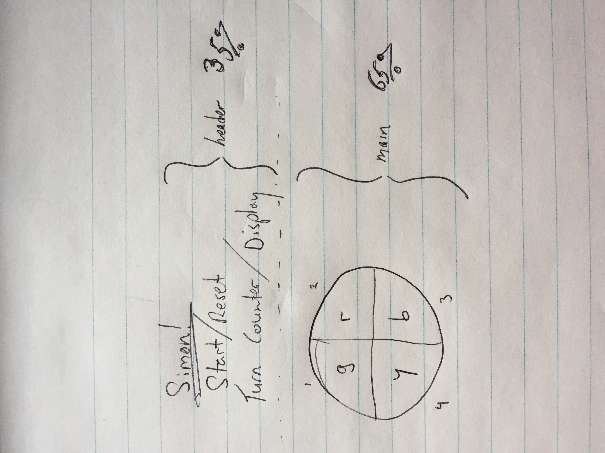

# simon-game

## Description

This project is focused on developing a memory game in which a player competes with an automated engine. It is based on a handheld eletronic game call [Simon](https://en.wikipedia.org/wiki/Simon_(game)).

## Click [here](https://billyhk.github.io/) to play.

**Below is a screen shot of the win game sequence**

## Technologies Used
* HTML
* CSS
* Javascript

## Installation Instructions
There are no special installation instructions. The app runs in the web browser (Google Chrome is recommended)

User Stories:
The player presses the start game button. A start game tone is played. The computer clicks one of four colored lights. The player mimics the action by clicking the same light. The turn counter above increases by 1. The computer clicks the light again but this time adds one more to the sequence. If the player mimics the sequence correctly, the turn counter is increased by one until reaching the last level. After beating the last level, a win game tone is played, the display reads “You Win”, and the lights flash randomly until the player presses the reset button.

**Below is my sketch of the webpage layout**

## Major Hurdles Overcame

The most difficult thing for me to solve was making the connection between creating the engine sequence (a for-loop that pushes values to an array) and successfully triggering the engine performance (a function). I realized that - after the creating the engine sequence (an array) - a function needed to determine whose turn it is (player or engine) with a conditional statement.

Another challenge was finding the right timing to ensure that each audio trigger fully sounds before moving on to the next action. This required lots of experimentation with the intervalId.
